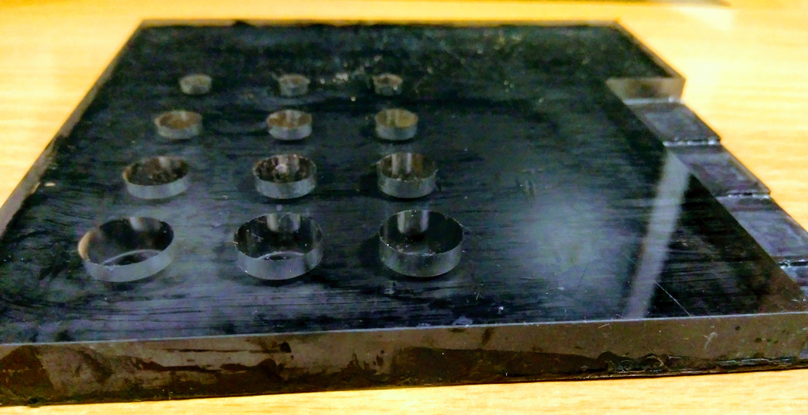
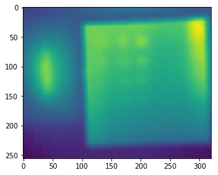

# Pulse-Thermography
Material defect detection with Pulse Thermography

pulsed thermography (PT) consists to briefly heat the specimen and then record the
temperature decay curve. Qualitatively, the phenomenon is as follow. The temperature of the
material changes rapidly after the initial thermal pulse because the thermal front propagates, by
diffusion, under the surface and also because of radiation and convection losses. The presence of
a defect reduces the diffusion rate so that when observing the surface temperature, defects appear
as areas of different temperatures with respect to surrounding sound areas once the thermal front
has reached them.

Defected material for defect detection

Result

 Detail discription in thr .ppt file in the folder 
